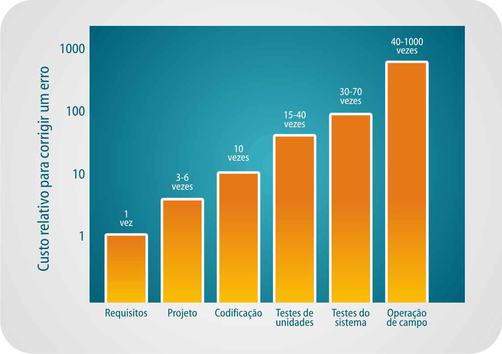
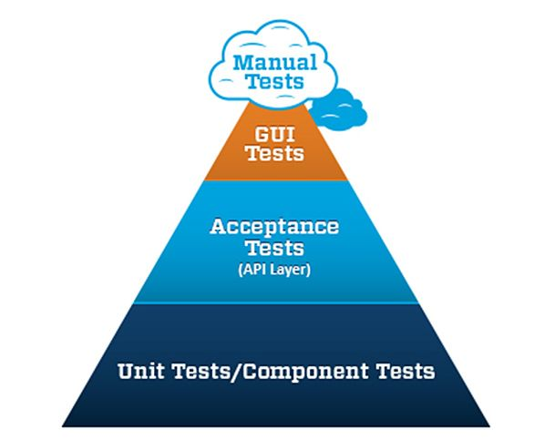
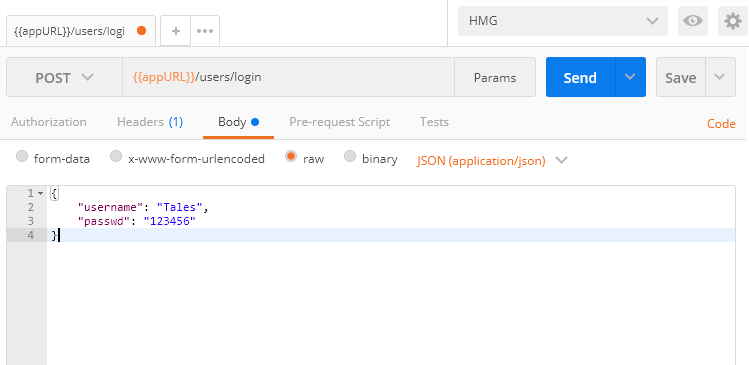
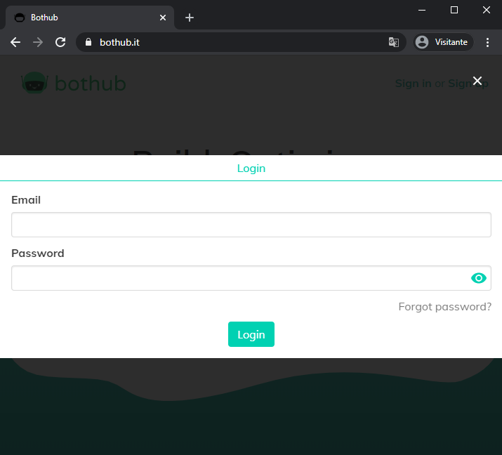
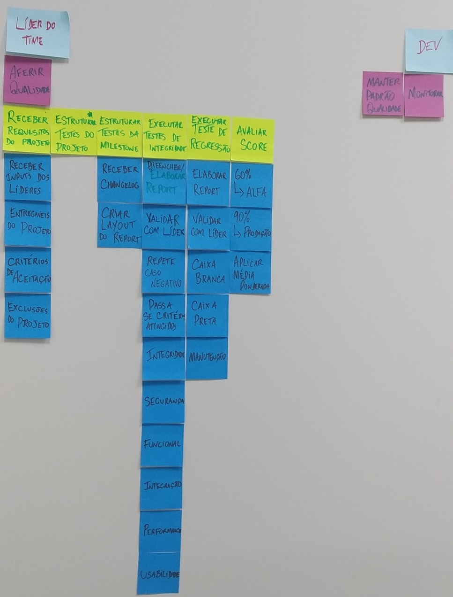
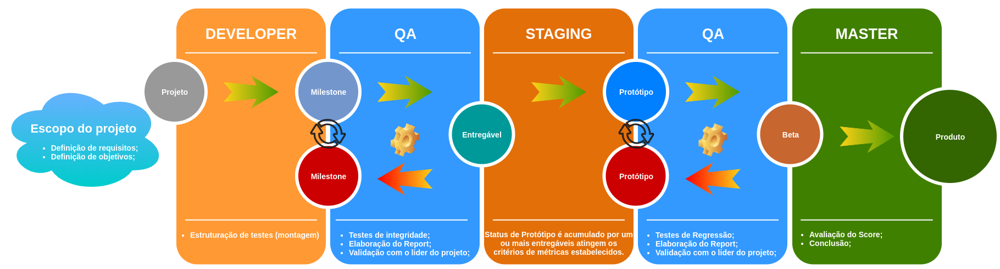
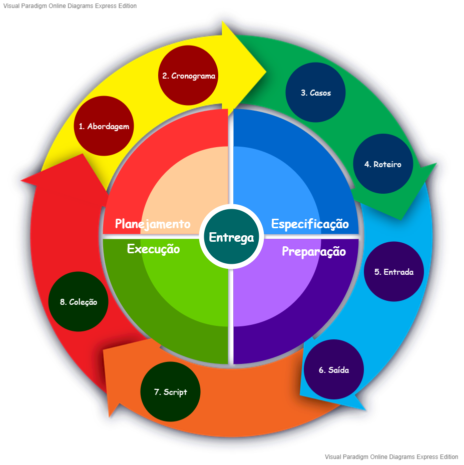

# Conteúdo envolvido no estudo da ferramenta Selenium para desenvolvimento de testes

> Razão de ser.

Segundo Myers "o custo para correção de bugs se eleva 10 vezes a cada estágio avançado pelo desenvolvimento do software", ele chamou isso de *Regra de 10*. Deve-se ainda levar em consideração impacto à credibilidade da empresa como um todo.



Os testes funcionais devem ser executados o mais cedo possível, que seria paralelo a fase de construção.  
Visando otimizar resultados, esses testes deveriam ser executados sempre que houvesse qualquer alteração (Bateria de regressão). Mas isso nos leva ao principal problema na estruturação de testes manuais. Imagine pedir para alguém realizar uma bateria de 100 roteiros de testes todos os dias e reportar sempre que detectar algum erro! Mesmo com uma documentação impecável, essa pessoa não trabalharia muito feliz.  
Como o foco dessa remodulação é construir meios de automação para nossas aplicações web, usaremos o Selenium para automatizar a interação do usuário com um browser.

> **Missão**

*Elevar projetos ao seu máximo potencial.*

**vs.**

*Entregar projetos surpreendentes com o máximo de satisfação do cliente.*

**Como?**

- *Realização de testes a cada milistone concluída, seja projeto ou produto.*
- *Métricas para resultados dos testes.*
- *Acionamento periódico, a ser agendado regularmente pelos líderes de cada projeto, para início dos processos de avaliação.*

## Escolha da ferramenta de automação

*[Selenium](https://selenium.dev/documentation/en) automates browsers, That's it!*
Essa é a exata definição da ferramenta em seu site oficial. Não se limitando a um framework de testes, ele é uma ferramenta que automatiza ações em browsers, gera massa de dados e coleta informações.

### Selenium IDE


Ferramenta do tipo *record and play*, disponível como plugin para o navegador Firefox exclusivamente.

### Selenium Web driver


API de métodos para a v3 do Selenium, disponível em diversas linguagens e suporta diversos browsers.

### Selenium Grid


Servidor de gerenciamento para máquinas que irão rodar os testes, inclusive realizando balanceamento de carga entre os nós conectados.

## Preparando o ambiente

`$ git init`

`$ npm init -y`

### Instalando lint

> Denomina-se lint o padrão de organização do código do projeto, desde boas práticas de identação, escolhas de classes e métodos até reutilização.

`$ npm install eslint --save-dev` *Instalar apenas em ambiente de desenvolvimento (Não irá para produção).*

`$ .\node_modules\.bin\eslint --init` *Iniciar o eslint.*

### Usando lint

`$ .\node_modules\.bin\eslint "fine_name.ext"` *Pode ser adicionado --fix para correções mais simples serem aplicadas automaticamente.*

## Estrutura da área

### Pirâmide de testes

Onde a Qualidade irá atacar e onde deverá apenas observar.



#### Proporção dos testes de uma aplicação

Enquanto os testes funcionais são os mais completos e mais próximos da forma como o usuário irá utilizar a aplicação também ocupam a menor proporção da pirâmide. Isso se deve aos custos envolvidos nessa camada de testes.  
No intervalo de alguns segundos que uma suite de 10k testes unitários é executada apenas um único teste funcional seria completado. Há também a necessidade de estruturação de toda a infra que componha o projeto (DB, Serviços, Frontend).  
Os custos de manutenção de testes funcionais também são elevados pois geralmente é a interface que sofre com a maioria das alterações. Bem como identificação dos problemas, enquanto o teste unitário foca exclusivamente na lógica, toda essa complexidade do ambiente do teste funcional torna o teste muito instável (problema com massa de dados, browser, rede, serviço fora do ar) e difícil de isolar um problema.  
A cobertura dos vários cenários possíveis para uma funcionalidade também é um fator que eleva o peso dos testes funcionais, onde cobrir todas as possibilidades é uma tarefa quase impossível.

#### Testes unitários

Onde os testes de código se dividem em porções mínimas, geralmente em granularidade de métodos.  
Difícilmente os códigos estarão completamente isolados, então são utilizados mocks para isolar o código que precisa ser testado de suas dependências (acesso ao BD, etc).

##### Exemplo de código

```js
// Código do módulo de login
public boolean verificarCredencial(String username, String passwd) {
  Usuario usuario = dao.getUsuarioByUsername(username);
  if(usuario != null) {
    return passwd.equals(usuario.getSenha());
  } else {
    throw new Exception("Usuário inexistente!");
  }
}

// Código do teste
@Test
public void testeVerificarCredencial() {
  //cenário
  Usuario usuarioMock = new Usuario("Tales", "123456");
  when(dao.getUsuarioByUsername("Tales")).thenReturn(usuarioMock);

  // Execução
  boolean logado = service.verificarCredencial("Tales", "123456");

  // Validação
  Assert.assertTrue(logado);
}
```

#### Testes de integração

Integra o código de cada módulo visando uma maior amplitude nos testes, normalmente desde o serviço (webservice, etc).

##### Exemplo de serviço

> Todos os dados e serviços do respectivo conjunto de módulos em teste devem estar ativos e operacionais. Lembrando que o ambiente ainda não é o de produção.



#### Testes funcionais

Verificações dos componentes externos e testes sob a visão do usuário.

##### Exemplo de testes

> Apesar da funcionalidade ser a mesma, a abordagem do teste muda completamente. Ao invés de observar o código da aplicação ou acessar algum serviço, a aplicação é avaliada do ponto de vista comportamental. Aqui o ambiente também não é o de produção.



### Roteiro de testes

Como o foco da área para Qualidade vem da perspectiva do usuário final, a diagramação dos roteiros de teste deve seguir a modelagem USM.



Visando não enviesar o teste para obter sempre sucesso, o escopo do que deve ser testado deve ser reportado através de um [Readme](https://wiki.ilhasoft.mobi/index.php/Qualidade/Requisitos/readme). O resultado da avaliação desse será compartilhado através de um [Milestone review](https://wiki.ilhasoft.mobi/index.php/Qualidade/Requisitos/report), que deverá ser usado pelo líder do projeto para guiar seus desenvolvedores no processo de correção. A devolução das ações tomadas acerca de cada *Milestone review* derá ser compartilhada num [Changelog](https://wiki.ilhasoft.mobi/index.php/Qualidade/Requisitos/changelog), assim estabelecendo um ciclo de revisão até que todos os pontos resaltados sejam concluídos.



> [Processo anterior](https://wiki.ilhasoft.mobi/index.php/Qualidade/Processos).

### Ecosistema

Composição do ambiente em cinco etapas.

#### Planejamento

Sob a ótica dos requisitos, devem ser elaborados:

- Abordagem: **Como** os testes serão executados;
- Cronograma: **Quando** os testes serão executados;

Esse planejamento deriva do [PM Canvas](https://online.visual-paradigm.com/drive/#diagramlist:proj=0&open) construído na etapa de levantamento de requisitos/fechamento do projeto. (Template disponível [aqui](https://s3.eu-west-1.amazonaws.com/ilhasoft-qualidade/PMCanvas.vpd).)

> Link útil: <https://wiki.ilhasoft.mobi/index.php/Qualidade/PMcanvas>

#### Especificação

Nes eguintes atividades: Elaborar/Revisar casos de testes e Elaborar/Revisar roteiros de testes.

> Caso de teste: consiste de uma referência a um identificador ou requisito de uma especificação;  
> Roteiro de teste: registro de passos a serem seguidos, entrada de dados e correspondente saída, resultado obtido vs. esperado;  
> **Obs.** o Roteiro de teste (ou parte dele) pode ser registrado num procedimento separado, para que possa ser compartilhada por mais de um caso de teste.

#### Preparação

A preparação do ambiente de testes consiste em provisionar todos os recursos necessários para que tudo possa ser executado em conformidade com o planejamento:

- Documentação;
- Cronograma;
- Ferramentas de automação;
- Infraestrutura;
- Pessoal;
- Massa de dados;

> Definições a serem estabelecidas:
>
> Critérios de entrada - indicam os itens a serem atendidos antes que o teste possa começar.
>
> - Ambiente de staging disponível;
> - Prazo;
> - Readme ou Changelog;
>
> Critérios de Saída - definem os itens que devem ser concluídos antes que possamos concluir o teste.
>
> - 50 testes completados para cada módulo;
> - Milestone review;
> - Liberação da infra provisionada;

#### Execução

Os testes são executados e os resultados obtidos são registrados.

A pilar fundamental dessa etapa são os artefatos produzidos no registro de cada script executado, agregando valor ao projeto e eliminando obstáculos no caminho até a entrega desejada.

> Um *script de teste* é a combinação entre um **caso**, um **roteiro** e os **dados** do teste.  >
> O script passa a ser uma *coleção* quando o teste envolver configuração, assim abordando também instruções detalhadas.

#### Entrega

Esta é a última fase do ciclo de vida de testes, onde o projeto é entregue e toda documentação é finalizada e arquivada.

## Na rota do teste


